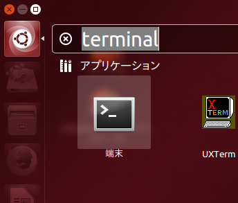
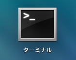

# ターミナルとシェル入門

## CUI
- MacもUbuntuも, Windowsと同じくGUIで操作可能です.
- ですが, プログラミングをする上でCUIは避けられません.
    - CUI ... Character User Interface
    - 文字によって操作を行うインターフェイスのことを指します.
    - Windowsならば, コマンドプロンプトに該当します.

## CUI
- 基本的なCUIの操作を, 実際に操作しながら体験してみましょう.
    - 一部コマンドはUbuntuのみでしか利用できず, Macのターミナルでは使えませんのでご了承下さい.

## ターミナルとシェル
- ターミナルを開くと, シェルを使った操作が出来るようになります.
    - プログラムの起動や制御をCUIで行うプログラムのことをシェルと呼びます.

## ターミナルの開き方(Ubuntu)

- 左上にあるUbuntuマークをクリックし, ｢terminal｣で検索すると, ｢端末｣が表示されますので, これをクリックします.

## ターミナルの開き方(Mac)

- Launchpadなどから｢ターミナル｣を選択し, 起動します.
    - 再掲ですが, ターミナルは頻繁に起動するため, Dockへ追加しておくことをおすすめします.

 
△ターミナルのアイコン

## シェルで使えるコマンド集
- Perl入学式の中でもよく使うコマンドを紹介します.
    - シェルには, これから紹介する以外にも様々なコマンドがあります.
    - OSやシェルの種類によって使えるもの, 使えないものがありますが, 使いこなせば作業の負担を軽減することができるでしょう.

## コマンド集(ls)
    $ ls
    デスクトップ ダウンロード (以下略)

- `ls`は, 現在居るディレクトリにあるファイルを表示します.
- `ls -a`は, ファイルを**全て**表示します.
    - `.`(ドット)で始まる, 通常は見えない隠しファイルも表示します

## コマンド集(pwd)
    $ pwd
    /home/username

- `pwd`は, 現在居るディレクトリを表示します.

## コマンド集(mkdir)
    $ mkdir sample
    $ ls
    sample デスクトップ ダウンロード (以下略)

- `mkdir DIRECTORY`は, `DIRECTORY`というディレクトリを作ります.

## コマンド集(cd)
    $ cd sample
    $ pwd
    /home/username/sample
    $ cd ..
    $ pwd
    /home/username

- `cd DIRECTORY`は, `DIRECTORY`に移動します.
    - 上のディレクトリは`..`で示します.

## コマンド集(rm)
    $ touch sample1 sample2
    $ ls
    sample1 sample2
    $ rm sample1
    $ ls
    sample2

- `rm [OPTION] FILENAME`は, `FILENAME`のファイルを削除します.
    - `target file`は半角スペースで区切ることで複数個指定することができます.
- ディレクトリを削除するときは, `[OPTION]`として`-r`を指定し, `rm -r DIR`で削除しなければなりません.
    - `r`は再帰(recursion)を意味します.
- ちなみに, `touch`はファイルが存在しないときに空のファイルを生成するコマンドです.

## コマンド集(cp)
    $ ls
    sample2
    $ cp sample2 sample1
    $ ls
    sample1 sample2

- `cp [OPTION] SOURCE DEST`は, `SOURCE`を`DEST`にコピーします.
- ディレクトリをコピーするときは, `[OPTION]`として`-r`を指定し, `cp -r SOURCE DEST`でコピーしなければなりません.

## コマンド集(mv)
    $ ls
    sample1 sample2
    $ mv sample1 sample_text
    $ ls
    sample_text sample2

- `mv [OPTION] SOURCE DEST`で, `SOURCE`を`DEST`に移動します.
    - ファイルやディレクトリの名前を変更する為にも使えます.

## コマンド集(nautilus)
    $ nautilus [DIRECTORY]

- `nautilus [DIRECTORY]`で, `DIRECTORY`をNautilusというファイルマネージャで開きます.
- `nautilus` で現在のディレクトリを開きます.
- MacにはNautilusが搭載されていないので, 使えません.

## コマンド集(open)
    $ open .

- `open DIRECTORY`で, `DIRECTORY`をFinderというファイルマネージャで開きます.
    - `open`は対象となるファイルの種類によって動作が変わります.
    - 例えばディレクトリが対象ならば上記のようにFinderで表示, テキストならばテキストエディタで表示...  という動作をします.
- Ubuntuでは利用できません.

## 練習問題
- ホームディレクトリに`perl-entrance`というディレクトリを作ろう.
    - ｢ホームディレクトリ｣とは, ユーザごとに用意された作業場所のようなものです.
    - `cd`を押すと, 自動的にホームディレクトリに移動します.
- 作った`perl-entrance`ディレクトリに移動しよう.
- カレントディレクトリ(`perl-entrance`)を, `nautilus`もしくは`open`を使って, ファイルマネージャで開いてみよう.
